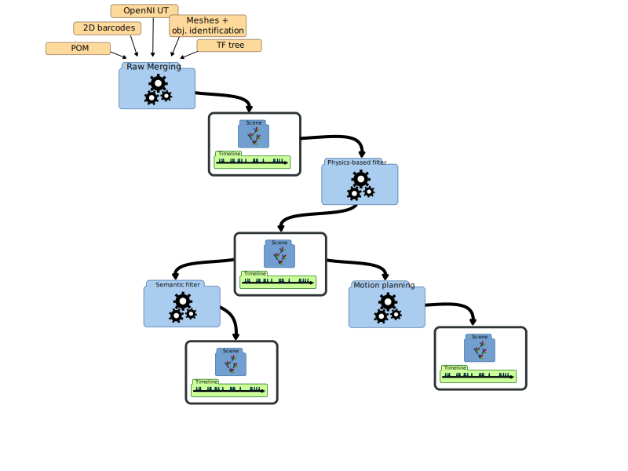
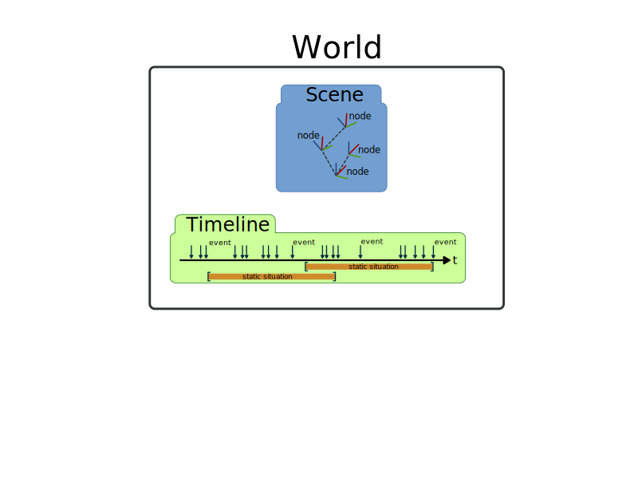
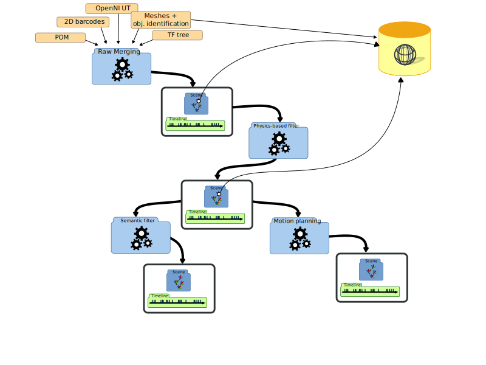

.. underworlds documentation master file, created by
   sphinx-quickstart on Mon Jan  4 16:51:42 2016.
   You can adapt this file completely to your liking, but it should at least
   contain the root `toctree` directive.

underworlds: Cascading Social Situation Assessment for Robots
=============================================================

underworlds is a **distributed and lightweight framework** that facilitates
**building and sharing models of the physical world** surrounding a robot
amongst independent software modules.

This modules can be for instance geometric reasoners (that compute topological
relations between objects), motion planner, event monitors, viewers... any
software that need to access a **geometric** (based on 3D meshes of objects)
and/or **temporal** (based on events) view of the world.

One of the main feature of underworlds is the ability to store many
*parallel* worlds: past models of the environment, future models, models with
some objects filtered out, models that are physically consistent, etc.

This package provides the underworlds server, a Python client library, and a set
of tools to interact with the system (viewers, scene loader, etc.).

A handful of useful example applications are also provided, like skeleton
tracking (using OpenNI) or visibility tracking.

Documentation Overview
~~~~~~~~~~~~~~~~~~~~~~

You can read below **details about underwords**: the `concepts`, the `scenes-nodes`.

You may then want to check the installation instructions: `installation`.

If you want to know more about the **core tools**, check this page: `core-tools`.

If you are looking for a **guide to write your own client application**:
`guide-application`.

If you want to read about the underworlds client-server **protocol** (for instance,
to add bindings with another language), head here: `protocol`.

Finally, the full `api-reference` is also available.

.. _concepts:

Main concepts
~~~~~~~~~~~~~

At very high-level, underworlds can be seen as a shared (across threads
and process) datastructure that represents on one hand **geometric
scenes** (made of 3D meshes for instance) and on the other hand the
history of these scenes as **timelines**. A pair (3D scene, timeline)
forms a **world**.

   A world is a 3D scene and its history, represented as a timeline

underworlds allows to create, alter, query, compare these worlds, their scences
and timelines in a distributed fashion: one application (an underworlds
**client**) can track the 3D position of humans around the robot, while another
detect some objects on tables, while a third exposes the current pose of the
robot itself. A fourth module can query these models to perform some motion
planning, and a fifth one can performs geometric reasoning using a physics
engine, and so on.

   Combining several processes in a cascade of worlds

The core library comes with a few useful components that can be used as
starting points for your own components.

`uwds-load <https://github.com/severin-lemaignan/underworlds/tree/master/bin/uwds-load>`__ for instance opens a static 3D model (like
a FBX file) and adds it to a specific world. Let's see how this example
work.

The interesting part of the loading takes place in `ModelLoader.load` :

First, we create a *context*: the context encapsulates a connection to
the shared datastructure. We give each context a name (typically, the
name of the component -- here ``model loader``): this is useful to
debug/introspect the system.

.. code:: python

    with underworlds.Context("model loader") as ctx:
        # ...

The context object ``ctx`` gives access to the shared worlds. For
instance:

.. code:: python

    ctx.worlds["test"]

either returns the world ``test`` if it already exists (some other
component may have created it, for instance) or it creates a new one
(which becomes immediately visible and accessible to every other
software components connected to the underworlds server).

Next, we can access the scene and the timeline attached to this world:

.. code:: python

    world = ctx.worlds["test"]
    scene = world.scene
    timeline = world.timeline

Keep in mind that ``world``, ``scene``, ``timeline`` are datastructures
shared amongst all the software components (clients) connected to the
server! A scene or a timeline can be updated at any time by any
component! While you iterate over a scene (for 3D rendering for
instance), underworlds makes no guarantee that the objects (nodes) will
remain constant during the iteration, and you need to be especially
careful for inconsistencies.

To avoid these inconsistencies as much as possible, software components
are therefore generally advised to only *write* to worlds that they have
themselves created. This is however not enforced, and sometimes it makes
perfectly sense to have several components updating together the same
world. One example could be several perception modules that estimate in
parallel the pose of different objects: they would typically update a
same world called for instance ``raw perception``.

.. _scenes-nodes:

Scenes and nodes
~~~~~~~~~~~~~~~~

A scene represents a 3D environment, made of a set of *nodes*: a node can
represent either a abstract entity (or frame), a physical object (or part
thereof), or a camera (more types of nodes may be added in the future, like
*fields*).  `Node` itself has several properties like a unique identifier, a
name, possibly a list of children nodes, a 3D transformation matrix relative to
its parent, etc.

   Meshes are centrally stored

Besides, nodes that represent physical objects (``node.type == MESH``)
have meshes attached. Because meshes can represent a large amount of
data, they are stored by the server on a separate static store, indexed
by their hash value. This way, only the hashes of the meshes are stored
with the node. If a specific component need the actual mesh data (for
instance, for rendering), it must separately request the mesh data from
the underworlds server (by calling ``ctx.get_mesh(<mesh hash>)``).

Scenes always have one special node, the *root node*, and every other
node in the scene is utimately parented to this node. It can be access
with ``scene.rootnode``.

*to be continued...*

.. _api-reference:

API Reference
=============

.. toctree::
    :maxdepth: 2
    
    api/underworlds.rst

Indices and tables
==================

* :ref:`genindex`
* :ref:`modindex`
* :ref:`search`

